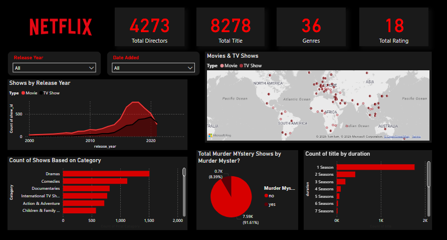

<h1>NETFLIX MOVIES & TV SHOWS DATA ANALYSIS POWERBI DASHBOARD</h1>

<h1><a name="introduction">Introduction</a></h1>

This project analyzes Netflix’s vast collection of movies and TV shows using data visualization techniques. By leveraging Power BI, the dashboard provides insights into various aspects of Netflix’s content library, including total titles, directors, genres, release trends, category distributions, and more.

<h1><a name="projectobjectives">Project Objectives</a></h1>

The objective of this project is to explore and visualize Netflix’s content library to gain meaningful insights into its distribution. Key goals include:

<ul>
<li> Understanding the number of movies and TV shows available.</li>
<li>Analyzing release trends over the years.</li>
<li>Examining genre and category distributions.</li>
<li>Identifying the prevalence of specific content types like Murder Mystery.</li>
<li>Analyzing content duration and global distribution.</li>
</ul>
<h1><a name='dashboard'>Dashboard</a></h1>

<h1><a name="visualizationtools">Visualization Tools</a></h1>
<ul><li>Tool used🛠️: Power BI</li>
<li> Data set used: <a href="https://www.kaggle.com/datasets/shivamb/netflix-shows">
          Netflix Dataset</a></li></ul>
Power BI has been used to create interactive dashboards that provide an intuitive and visually appealing way to analyze Netflix data. The tool allows for filtering, drill-down analysis, and dynamic representations of trends and distributions.

<h1><a name="conclusion">Conclusion</a></h1>

The Netflix content dashboard provides valuable insights into the platform’s content library. The analysis highlights trends in content release, popular genres, and categorical distributions. The interactive nature of Power BI enables deeper exploration of data, making it a powerful tool for media analytics.

